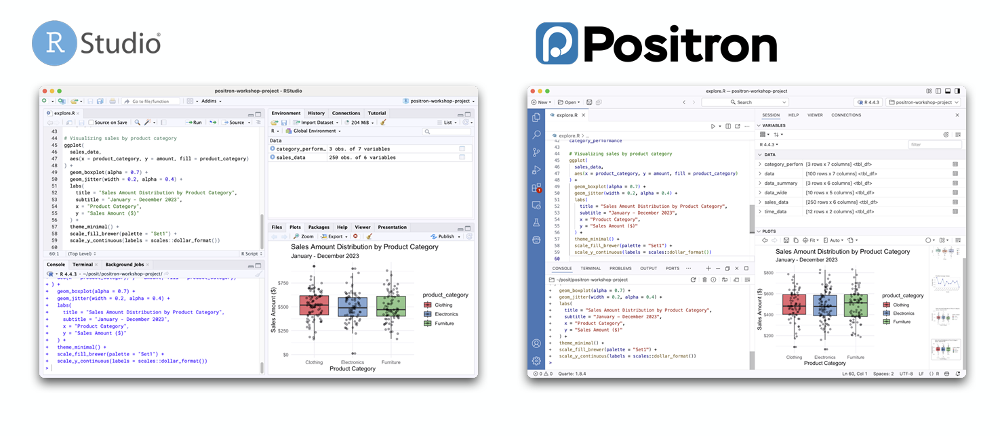
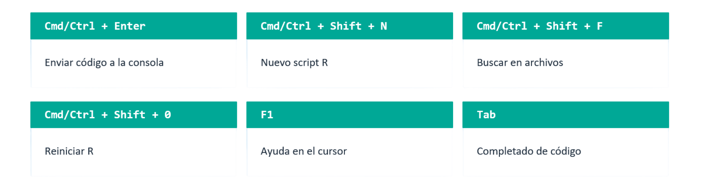
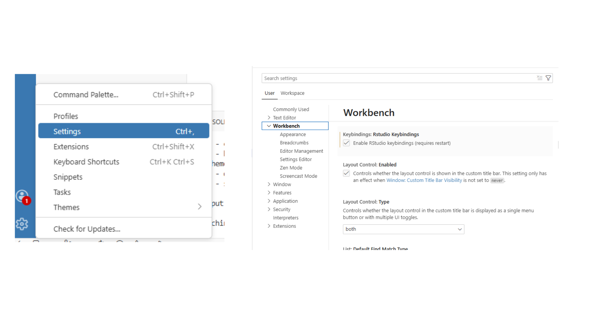
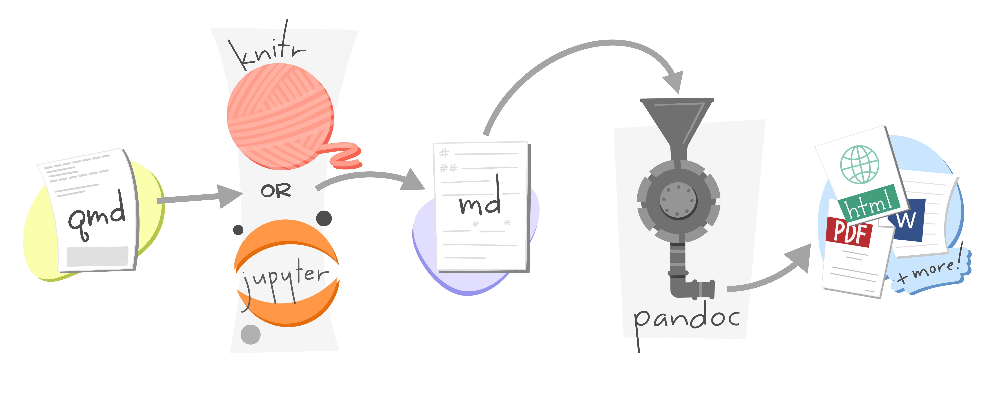
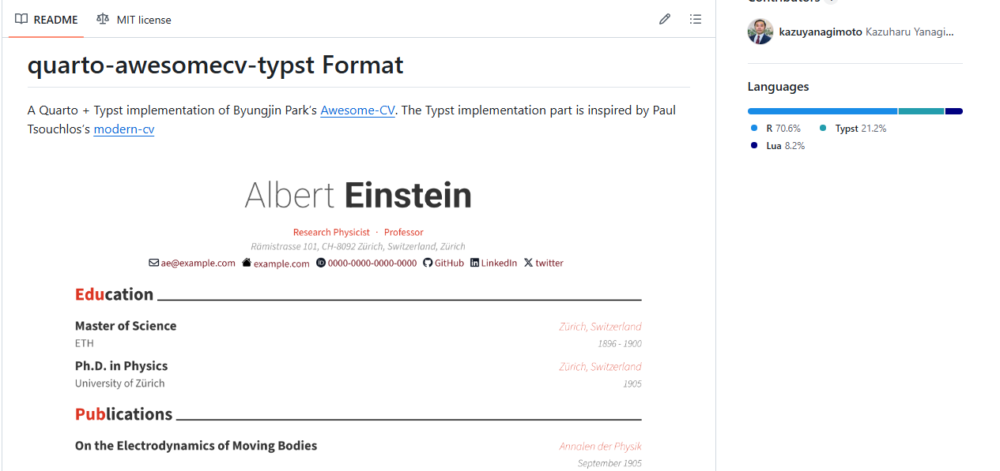

---
format:
  revealjs: 
    theme: [default, ppt.scss]
    width: 1280
    height: 720
    include-after-body: 
    - "all-the-js-code.html"
pagetitle: hacer ppts es mi pasión
echo: false
menu: false
code-line-numbers: false
revealjs-plugins:
  - codewindow
  - highlightword
editor:
  render-on-save: true
---

##  {.center style="text-align: center;" background-color="#6A94B4"}

Get ready with me para

::: {.r-fit-text .title-text .text-pink}
armar mi [CV]{.flow-quarto} en

{width="737"}
:::

## ¿Qué es Positron? {background-color="#F0F8FF"}

:::::::::: columns
:::: {.column width="44%"}
::: dark-card
**Un IDE de nueva generación**

-   Desarrollado por Posit (ex-RStudio)
-   Basado en VS Code (open source)
-   Soporte nativo para **R y Python**
-   Integra Quarto de fábrica
-   Actualmente en Beta (2024–2025)
:::
::::

::::::: {.column width="56%"}
**¿Por qué importa?**

::: feature-row
🔬   Pensado para el flujo de trabajo científico de datos
:::

::: feature-row
🐍   Un solo IDE para R y Python juntos
:::

::: feature-row
🚀   Potencia de VS Code + experiencia de RStudio
:::

::: feature-row
📄   Quarto integrado sin configuración extra
:::
:::::::
::::::::::

## La Interfaz de Positron



::: footer
Fuente: /https://posit-dev.github.io/positron-workshop/slides/02-explore.pdf
:::

## Positron vs RStudio {background-color="#F0F8FF"}

|               | **RStudio**                   | **Positron**                   |
|--------------|----------------------------|------------------------------|
| Lenguajes     | Solo R                        | R y Python nativamente         |
| Navegación    | Menús y botones               | Command Palette + clic derecho |
| Paneles       | Environment / History / Files | Variables · Explorer · Git     |
| Proyectos     | `.Rproj` como proyecto        | Carpeta = proyecto             |
| Output        | Inline chunk output           | Output en consola              |
| Visualización | Salida directa de plots       | Panel Plots + Data Explorer    |

::: footer
Fuente: /https://posit-dev.github.io/positron-workshop/slides/02-explore.pdf
:::

## Lo que se mantiene igual



## Cómo configurarlo



::: caption
\* Activar con: Ajustes → [RStudio Keybindings](positron://settings/workbench.keybindings.rstudioKeybindings)
:::

## Ventajas clave de Positron

:::::::::::: columns
::::: {.column width="33%"}
::: feature-card
**⚡ Command Palette**

Cada acción con `Cmd+Shift+P`. Búsqueda rápida y shortcuts personalizables.
:::

::: feature-card
**🖋️ Quarto Nativo**

Preview, insertar celdas y navegar secciones. Sin configuración adicional.
:::
:::::

::::: {.column width="33%"}
::: feature-card
**📊 Data Explorer**

Inspección interactiva de dataframes con filtros y estadísticas por columna.
:::

::: feature-card
**🐍 Python + R**

Ambos kernels en la misma sesión. Variables y plots en el mismo panel.
:::
:::::

::::: {.column width="33%"}
::: feature-card
**🌿 Git Integrado**

Panel de cambios, commits y push/pull sin salir del IDE.
:::

::: feature-card
**🔌 Extensiones**

Acceso al registro Open VSX. Miles de extensiones disponibles.
:::
:::::
::::::::::::

> 💡 La ventaja no es usar los distintos lenguajes a la vez, sino no tener que aprender un IDE diferente cuando necesitás hacer algo en Python.

## Múltiples sesiones

:::::::::: columns
::::::: {.column width="50%"}
**Positron puede correr sesiones concurrentes:**

::: feature-row
🔢   Múltiples versiones de R simultáneamente
:::

::: feature-row
🐍   Mezclar sesiones de R y Python
:::

::: feature-row
📋   Varias instancias de la misma versión
:::

::: feature-row
🔄   Reiniciar una sesión sin afectar las otras
:::
:::::::

:::: {.column width="50%"}
::: dark-card
**¿Para qué sirve?**

-   Tarea larga en una sesión → seguir trabajando en otra
-   Comparar dos versiones de R o de un paquete en vivo
-   Desarrollar una vignette en sesión aislada
-   Probar que tu código funciona en la versión del servidor
:::
::::
::::::::::

# `.rproj` vs. 📁carpetas

## 📁 RStudio: Proyectos con `.Rproj`

-   Coloca un archivo **`.Rproj`** en la carpeta para designarla como proyecto.
-   Ese archivo almacena preferencias a nivel de proyecto (codificación, tipo de indentación, wrap de Markdown, etc.).
-   Sirve para **lanzar el proyecto** directamente y como **ancla de la raíz** (usado por `here::here()`).

```         
mi-proyecto/
├── mi-proyecto.Rproj   ← marca la raíz del proyecto
├── datos/
├── scripts/
└── resultados/
```

## 📂 Positron: Carpetas sin archivo especial

-   Positron **no coloca ningún archivo** equivalente al `.Rproj` en la carpeta.
-   Si se configuran preferencias a nivel de espacio de trabajo, se crea automáticamente un archivo **`.vscode/settings.json`** para almacenarlas.
-   `here::here()` sigue funcionando, pero encuentra la raíz a través de la carpeta **`.git`** (no del `.Rproj`).

```         
mi-proyecto/
├── .git/                    ← ancla de raíz para here::here()
├── .vscode/
│   └── settings.json        ← preferencias locales (opcional)
├── datos/
├── scripts/
└── resultados/
```

## ⚠️ El archivo `.Rproj` en Positron

-   Positron **ignora el contenido** del `.Rproj`: no lee sus preferencias.
-   Preferencias como `UseSpacesForTab`, `MarkdownWrap` o `NumSpacesForTab` deberán configurarse manualmente en Positron.
-   Para proyectos Quarto, algunas de esas preferencias conviene migrarlas a `_quarto.yml`.

# Armemos nuestro **CV** {.title-text .center style="text-align: center;" background-color="#6A94B4"}


## Antes de arrancar

::: {.fragment .fade-in-then-out .r-fit-text}
¿Quién alguna vez usó `Quarto`? 🙋‍♀️
:::

::: {.fragment .fade-in-then-out .r-fit-text}
¿Quién alguna vez usó `RMarkdown`? 🙋‍♀️
:::

::: {.fragment .fade-up .r-fit-text}
Sé qué es `Quarto` / `Rmarkdown` pero nunca lo usé 🙋‍♀️
:::

# Quarto



# `{typst}`

:::: {.columns}

::: {.column width="40%"}

:::

::: {.column width="60%"}
Es un sistema de composición de documentos (como Latex). Mucho más intuitivo y rápido.
:::

::::

::: footer
Más info en [typst.app](https://typst.app/)
:::

## Extensiones en `{quarto}`

Es un paquete que amplía las capacidades del sistema de publicación Quarto. Quarto por sí solo ya permite generar documentos, sitios web, presentaciones y más desde R o Python; una extensión agrega funcionalidades extra, como nuevos formatos de salida, plantillas, filtros de transformación, shortcodes personalizados o plugins para presentaciones. 

## `{awesomecv}`



::: callout-tip
## Fuente
Plantilla de Kazuya Nagimoto — [quarto-awesomecv-typst](https://github.com/kazuyanagimoto/quarto-awesomecv-typst)
:::


## Instalación 

En nuestra terminal: 

::: {.codewindow}
Terminal
```bash
quarto use template kazuyanagimoto/quarto-awesomecv-typst
```
:::

Instalamos el paquete en `r`. Ponemos en la consola:

::: {.codewindow}
Consola
```r
install.packages("typstcv", repos = "https://kazuyanagimoto.r-universe.dev")
# Instalamos tidyverse también que nos va a permitir manipular los datos
install.packages("tidyverse")
```
:::

## The boy who lived is a data scientist

:::: {.columns}

::: {.column width="40%"}

:::

::: {.column width="60%"}
Harry Potter lleva 20 años como Auror, pero descubrió que le apasiona el análisis de datos. Ahora quiere postularse como Analista de Ciencias de Datos en el Ministerio de Magia. Para mostrar cómo funciona esta herramienta, vamos a usar su caso
:::

::::


## Armamos nuestro excel o csv {.smaller}

```{r}
library(typstcv)
library(dplyr)
df_cv <- readxl::read_excel('harry_potter_cv_es.xlsx')

DT::datatable(df_cv)
```

# Manos a la obra! 

 

##  {.center style="text-align: center;" background-color="#6A94B4"}

::: {.r-fit-text .title-text .text-pink}
Otras cositas de

{width="737"}
:::

## 🤖 IA: Positron Assistant {.smaller}

Positron incluye **Positron Assistant**, un cliente de IA integrado directamente en el IDE. Tiene dos modos:

-   Se activa desde el ícono en la barra lateral izquierda.
-   Podés agregar contexto: el archivo actual, una selección de código, o datos del entorno.
-   Se puede usar también dentro del editor.

## 📦 rig: el gestor de versiones de R

**rig** (*R Installation Manager*) es una herramienta de línea de comandos que te permite instalar y administrar múltiples versiones de R en la misma máquina, de forma limpia y sin conflictos.

### ¿Por qué importa? {.smaller}

Cuando trabajás en varios proyectos, es común que uno requiera R 4.2 y otro R 4.4. Sin un gestor, cambiar de versión manualmente es tedioso y propenso a errores. rig lo hace en un solo comando.

-   **Instala y desinstala versiones de R** — `rig add 4.4.0`, `rig rm 4.2.1`
-   **Cambia la versión por defecto** — `rig default 4.4.0`
-   **Crea librerías de paquetes separadas por versión** — cada R tiene sus propios paquetes instalados, sin pisar los de otras versiones

> 🔗 Instalación: [github.com/r-lib/rig](https://github.com/r-lib/rig)

## 🖊️ Air: formateador de código R

**Air** es un formateador de código R automático, similar a lo que hace `prettier` en JavaScript o `black` en Python. Su función es tomar tu código y dejarlo con un estilo consistente, sin que tengas que pensar en la indentación, los espacios o el largo de las líneas.

-   **Formatea automáticamente** al guardar el archivo (si lo configurás así en Positron)
-   **Sigue convenciones ampliamente adoptadas** en la comunidad R
-   **Configurable** a nivel usuario (global) o por proyecto (`.air.toml`)
-   **Integrado con Positron** — aparece como formateador disponible en la configuración del editor

> 🔗 Más info: [posit-dev.github.io/air](https://posit-dev.github.io/air)

# Fuentes

-   Formoso, J (2024). Transforma tus datos en historias visuales con Quarto. Disponible en este [enlace](https://github.com/JFormoso/quarto-rladiesBA)

-   Mock T (2022) 05 - Presentations. Presentación realizada para RStudio - conf. Disponible en este [enlace](https://rstudio-conf-2022.github.io/get-started-quarto/materials/05-presentations.html#/presentations)

-   Blog de slidecraft 101 [enlace](https://emilhvitfeldt.com/blog#category=slidecraft%20101)